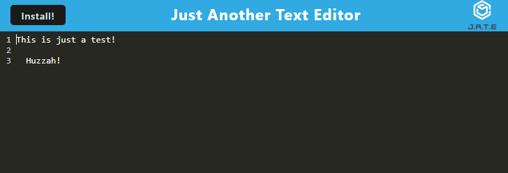

# PWA Text Editor

[Link to Live App](https://afternoon-river-10125-70400daa5ffb.herokuapp.com/)

## Description
The **Just Another Text Editor** Progressive Web Application is a text editor much like the command line interface. You can type messages or notes, and once you click off the page, the data will save and will remain accessible upon reload or later visit!

## Screenshot

## Installation
N/A

## Usage

### From the Web Interface
* Navigate to the site [with this link](https://afternoon-river-10125-70400daa5ffb.herokuapp.com/)
* Erase the existing title text if you choose.
* Type in whatever text you'd like.
* When you're ready to save, click off the command line to unfocus from the program, which will save your data.
* When you reload or visit the page again, you'll find the text you've written previously is still there!
* For easier access, you can download this PWA to your desktop by either clicking the **Install** button on the top left side of the page, or you can click the download link in the address bar of the browser

### From the GitHub Repo
* Download the program files to computer.
* Open the CLI and use command `npm run start` to build the dist folder and start the server
* Open a browser and use the address `http://localhost:3000/`
* The PWA should appear in your browser window, and the above directions will assist you from here!

## References
* Referenced Mini Project code from Unit 19
* Assistance from the instructor

## License
Please refer to the license in the repo.
- - -

